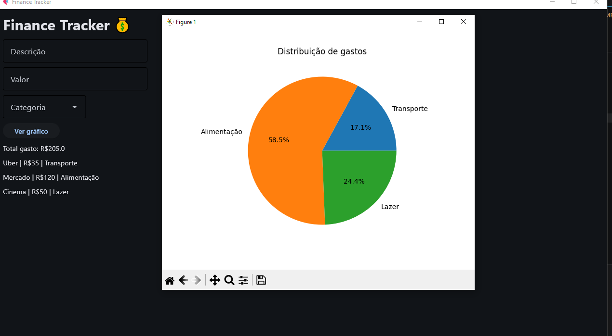

# FinanceTracker Mobile 💰

Aplicativo mobile de controle financeiro desenvolvido com Python, Flet e Matplotlib.

## Funcionalidades

✅ Adicionar gastos  
✅ Categorizar despesas  
✅ Salvar dados em JSON  
✅ Manter gastos após fechar o app  
✅ Visualizar gráficos por categoria  
✅ Dashboard com gasto total  

## Preview do App

## Tecnologias

- Python
- Flet
- Matplotlib
- JSON
- Git
- GitHub

## Como executar

Instalar dependências:

pip install -r requirements.txt

Executar:

python main.py

## Autor

Roger Belchior Marcilio